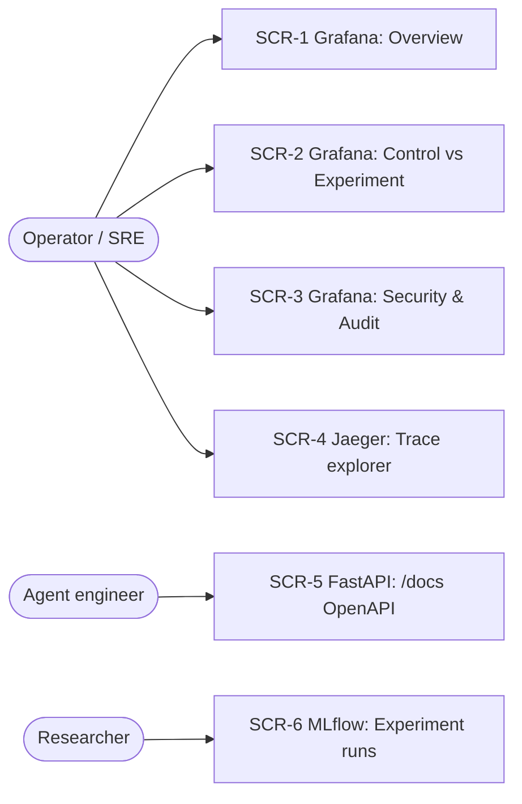

# Wireframes — Protocol Gate operator & observability surfaces

- **Status:** Accepted
- **Owner:** Ronald (@ngronald-profitrise)
- **Last updated:** 2026-09-25
- **Related:** [DESIGN.md](DESIGN.md) · [infra/grafana/dashboards/](infra/grafana/dashboards/)

Protocol Gate has no end‑user GUI; its "screens" are the **operator and observability surfaces**. Each screen has a stable identifier (`SCR-n`) referenced from issues and dashboards.

## Screen map



## SCR-1 — Grafana: Overview

The at‑a‑glance health of the gate.

```
┌──────────────────────────────────────────────────────────────────────┐
│ Protocol Gate — Overview                         [arm ▾]  [now-1h ▾] ⟳ │
├───────────────┬───────────────┬───────────────┬────────────────────────┤
│ Proposals/sec │ Unauthorized  │ Audit         │ Rejections/sec         │
│    12.4       │ effects: 0 ✅ │ completeness  │     3.1                │
│               │               │   1.00  ✅    │                        │
├───────────────┴───────────────┴───────────────┴────────────────────────┤
│  Proposal outcomes (accepted/rejected)  │ Rejections by reason code     │
│  ▁▂▅▇▇▅▂  line chart                     │  stacked area by code         │
├──────────────────────────────────────────┼───────────────────────────────┤
│  Gate step latency p95 (per step)        │ Model throughput (tokens/sec) │
│  12 series (one per PAVSCE-A step)       │  line per model               │
└──────────────────────────────────────────┴───────────────────────────────┘
```

**Key element:** *Unauthorized effects* must read **0** for the gated arm — it is the visual proof of the guarantee.

## SCR-2 — Grafana: Control vs Experiment

Head‑to‑head A/B view.

```
┌──────────────────────────────────────────────────────────────────────┐
│ Protocol Gate — Control vs Experiment                                  │
├────────────────────┬────────────────────┬──────────────┬──────────────┤
│ Replay success     │ Replay success     │ Injection    │ Injection    │
│ CONTROL:  4 ❌     │ EXPERIMENT: 0 ✅   │ CONTROL: 3❌ │ EXPERIMENT:0✅│
├────────────────────┴────────────────────┴──────────────┴──────────────┤
│  Unauthorized effects: control vs experiment (two series)              │
├────────────────────────────────────────────────────────────────────────┤
│  State violations: control vs experiment                              │
├────────────────────────────────────────────────────────────────────────┤
│  Proposals by arm & result (throughput, split)                        │
└────────────────────────────────────────────────────────────────────────┘
```

## SCR-3 — Grafana: Security & Audit

```
┌──────────────────────────────────────────────────────────────────────┐
│ Protocol Gate — Security & Audit                                       │
├────────────────────┬────────────────────┬────────────────────────────┤
│ Unauthorized (all) │ Replay (all)       │ Injection (all)            │
├────────────────────┴────────────────────┴────────────────────────────┤
│  Scrub actions by type      │ Rejection taxonomy (stacked)           │
├──────────────────────────────┴────────────────────────────────────────┤
│  Gate decision log (Loki)   {container="pg-gate-api"} |= "decision"   │
│  2026-09-25T… decision=REJECT reason=REPLAY_DETECTED actor=…          │
└──────────────────────────────────────────────────────────────────────┘
```

## SCR-4 — Jaeger: Trace explorer

Each `evaluate()` call is a trace with up to 12 child spans (one per step). Operators drill into a slow or rejected proposal to see exactly which step fired and how long it took.

```
Trace: gate.evaluate  (span 4.2ms)
 ├─ parse                 0.3ms
 ├─ authenticate          0.4ms
 ├─ anti_replay           0.2ms
 ├─ correlate             0.3ms
 ├─ validate_authority    0.5ms   ← reject: INSUFFICIENT_CAPABILITY
 └─ (short-circuit)       audit written
```

## SCR-5 — FastAPI: OpenAPI docs

Interactive API surface at `/docs`:

- `POST /gate/evaluate` — submit a (scrubbed) proposal, receive decision.
- `GET /state/{instance_id}` — inspect current protocol state.
- `GET /health/live`, `GET /health/ready` — liveness/readiness.
- `GET /metrics` — Prometheus exposition.

## SCR-6 — MLflow: Experiment runs

Each A/B run logs parameters (model, scenario set, iterations) and metrics (unauthorized effects, replay/injection successes, latency) per arm, so researchers can compare runs over time.
