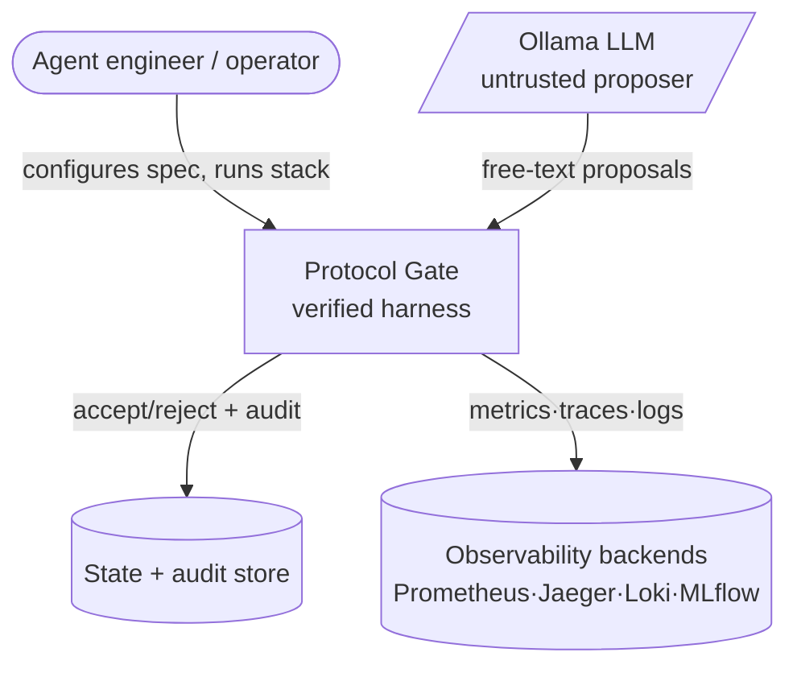
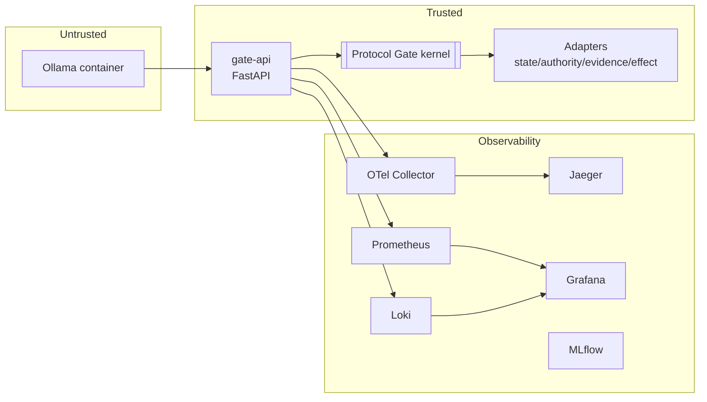

# Building blocks

A C4‑style decomposition of Protocol Gate, from context down to components.

## Level 1 — System context

## Level 2 — Containers

## Level 3 — Components (kernel & friends)

| Component | Module | Responsibility |
|-----------|--------|----------------|
| Scrubber | `protocol_gate/scrubber.py` | Trust boundary: sanitize untrusted model output into a typed proposal; record scrub actions. |
| Models | `protocol_gate/models.py` | Domain types: proposals, state, decisions, rejection codes, audit records. |
| State machine | `protocol_gate/state_machine.py` | Pure transition legality/target computation from the spec. |
| Kernel | `protocol_gate/kernel.py` | Orchestrates the 12 PAVSCE‑A steps; total, fail‑closed. |
| Audit | `protocol_gate/audit.py` | Builds append‑only audit records for every decision. |
| Rejection | `protocol_gate/rejection.py` | The rejection taxonomy + helpers. |
| Adapters | `adapters/*` | I/O behind `Protocol` interfaces (memory + postgres). |
| Spec loader | `specs/loader.py` | Loads + validates the declarative protocol spec. |
| Harness | `harness/*` | Ollama client, proposer, runner feeding proposals to the gate. |
| API | `api/*` | FastAPI surface + OTel middleware + health/metrics. |
| Experiments | `experiments/*` | Control (ungated) vs experiment (gated) A/B + scenarios. |
| Benchmarks | `benchmarks/*` | Prometheus metrics + runner + reporter. |

## Level 4 — Key runtime path

`scrub(text)` → `UntrustedProposal` → `ProtocolGate.evaluate()` → (steps 1‑12) → `AcceptedTransition | RejectedProposal` → commit + effects + `AuditRecord` → metrics/traces/logs.

See [DESIGN.md](../../DESIGN.md) for the full narrative.
